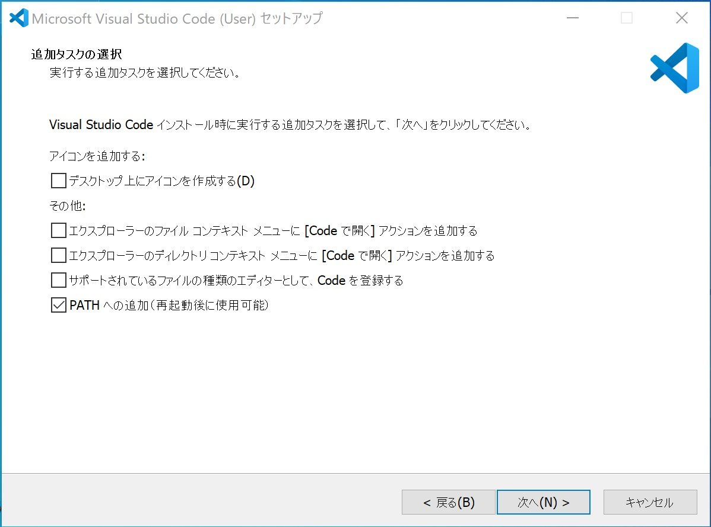
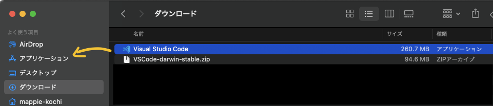
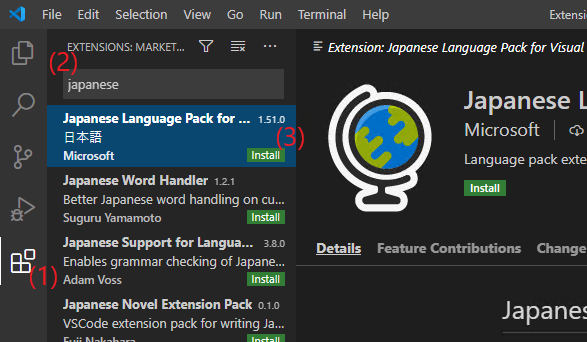
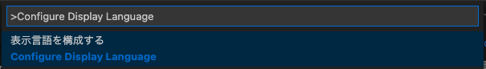

# VS Code をインストールしよう

公式ドキュメント: https://code.visualstudio.com/docs/setup/setup-overview

## インストーラーのダウンロード

Web ブラウザで [公式サイト](https://code.visualstudio.com/) https://code.visualstudio.com にアクセスし、インストーラーを**ダウンロード**します。  
**Download for Windows**（macOS の場合は Download for Mac）ボタンを選択し、インストーラーのダウンロードを行ってください。

## VS Code のインストール

### Windows の場合

ダウンロードした**インストーラーを実行**して、VS Code をインストールします。  
基本的に、インストーラー画面に表示される内容に従って、インストールを進めてください。

1 点、インストーラー内の「追加するタスクの選択」画面にて、`code コマンドをインストールするかどうか`尋ねられる箇所があります。  
この時、「PATH への追加（再起動後に使用可能）」の**チェックボックスを必ず選択**するようにしてください。 （デフォルトでチェックされた状態になっています）

### macOS の場合

zip ファイルがダウンロードされるため、ファイルを解凍します。  
解凍したファイル `Visual Studio Code` を選択し、`ドラッグ&ドロップ`で**アプリケーション ディレクトリにファイルをコピー**します。

インストールが完了したら、Visual Studio Code を起動し、**F1** キーを押してコマンドパレットを開きます。  
コマンドパレット内で、`Install` と入力し、表示されるコマンド **Shell Command: Install 'code' Command in PATH** を選択してください。

### Linux の場合

RPM パッケージ、deb パッケージの他、Snap Store、apt リポジトリなどで提供されています。  
各 OS で用意されているパッケージマネージャーを利用して、インストールを行うことを推奨します。

Snap Store、apt リポジトリの場合は、パッケージシステムを利用してアップデートを行うこともできます。

詳しい内容については、以下の公式情報を確認してください。

https://code.visualstudio.com/docs/setup/linux

## 表示言語に日本語を設定しよう

初期状態では、メニューの言語は`英語`になっています。  
**日本語メニューに変更したい**場合、以降の手順を実施してください。英語のままで問題ない方は、次のトピックに進んでください。  
※本ハンズオンでは、表示言語が日本語であることを前提に進めます。

1. アクティビティーバー（画面左端のタブメニュー）から**拡張機能タブを選択**します。
2. サイドバー（画面左側のエリア）にある `Search Extensions in Marketplace` 欄に **japanese** を入力します。
3. サイドバー中に `Japanese Language Pack for Visual Studio Code` という項目が出てくるので選択します。右側に拡張機能の詳細が表示されるので、**インストール** ボタンを選択します。
4. 通知ポップアップ（画面右下）に `Would you like to change VS Code's UI language to Japanese and restart?` と表示されるため、**Yes** を選択します。
5. 再起動を促すポップアップが表示された場合は、**再起動** を選択します。

ポップアップを閉じてしまったり、表示されない場合は、コマンドパレットを使用して表示言語を日本語に変更します。  
**F1** キーを押してコマンドパレットを表示し、`Configure Display Language` を入力してください。  
入力後、表示される `表示言語を構成する` を**選択**し、続いて表示される選択肢にて `ja` を**選択**します。  
再起動を促すポップアップが表示された場合は、**再起動** を選択してください。

