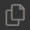
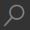
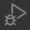
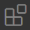
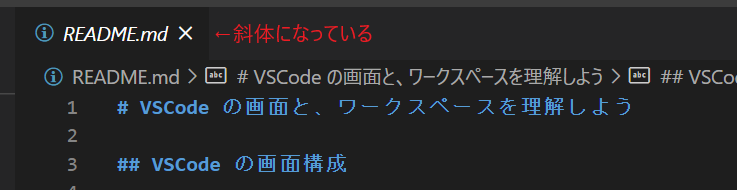
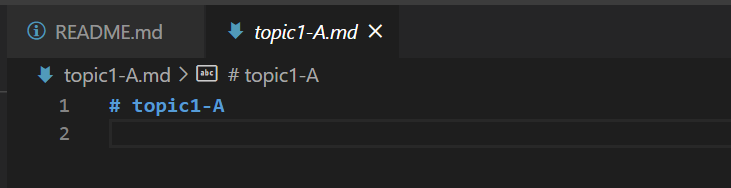
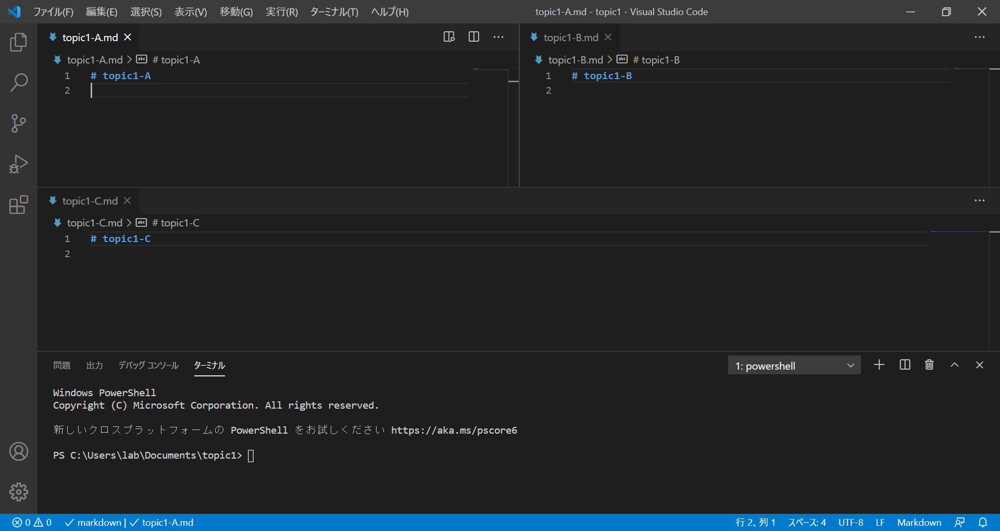
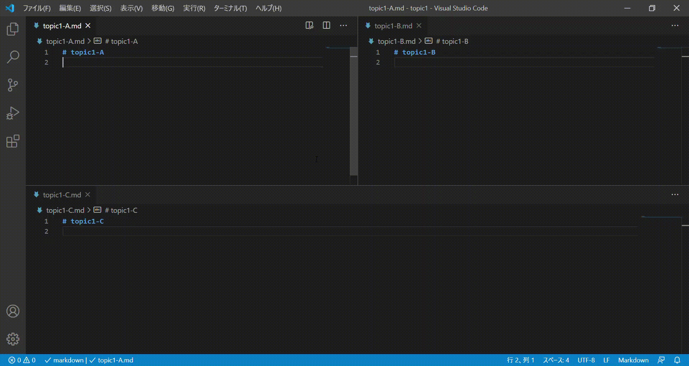

# VS Code の画面と、ワークスペースを理解しよう

## VS Code の画面構成

VS Code は下図のように複数のエリアで構成されています。

### エディター

ファイル編集を行うエリア。  
複数のファイルを開くだけでなく、タブをドラッグ&ドロップすると、ファイルを横にならべたり、縦に並べたりもできます。

### サイドバー

アクティビティバーの各アイコンの内容が表示されるエリア。
macOS: `Cmd + B`、windows・linux: `Ctrl + B`で表示・非表示ができます。

### アクティビティバー

サイドバーに表示できる機能が並んだエリア。
アイコンをクリックすることで、その機能をサイドバーに表示・非表示することができます。  
また、アイコンをドラッグすると並びを変えることができます。

|              基本の機能              |                               |
| :----------------------------------: | :---------------------------- |
|   | エクスプローラービュー        |
|     | 検索ビュー                    |
|        | ソースコントロールビュー(Git) |
|      | デバッグビュー                |
|  | 拡張機能ビュー                |

### ステータスバー

エディターで開いているファイルの情報が表示されるエリア。

### パネル

コンソールログ、エラーや警告、ターミナルを表示するエリア
macOS: `Cmd + J` 、windows・Linux: `Ctrl + J` で表示・非表示ができます。

## エディターにファイルを表示する

エクスプローラービューで任意のファイルをクリックするとエディターにファイルが表示されます。
エディター上部にはタブが現れ、ファイル名が表示されています。

よく見ると、タブ上のファイル名が斜体で表示されているのがわかります（下図）。この斜体は`一時的に開いているファイル`であることを表しています。
他のファイルを開いたとき、この「一時的に開いているファイル」は閉じられます。

実際に「一時的に開いているファイル」を表示した状態で、他のファイルを開いてみましょう。  
最初に開いていたファイルが閉じ、同じタブ上にファイルが開かれたと思います。

**一時的に開いているファイル**

ファイルを編集したり、タブをダブルクリックすると、「一時的に開いているファイル」ではなくなり、（タブ上のファイル名の斜体が解除される）、この状態で他のファイルを開くと、そのファイルは別のタブで開かれます。

実際に「一時的に開いているファイル」のタブをダブルクリックした後、他のファイルを開いてみましょう。  
ファイルが別のタブで開かれたと思います。

**ファイルが別のタブで開かれる**

## ワークスペースとは

あるプロジェクトの作業をするとき、必要なファイル等を 1 つのフォルダーにまとめて管理するのが主流かと思います。
VS Code ではそのようなプロジェクトごとの作業環境を`ワークスペース`と呼んでいて、VS Code で開いたフォルダは「ワークスペース」として扱われます。

ピンとこないかもしれませんが、
ひとまずここでは「VS Code で開かれたフォルダは"ワークスペース"と呼ばれる」くらいの認識で OK です！

## 課題 1

VS Code の UI を下図のように表示させてください。

- サイドバーは表示しない
- 下部にパネルを表示する
- エディターは上下に 2 分割する
  - 下部には`topic1-C.md`を表示する
  - 上部はさらに左右に 2 分割する
    - 左に`topic1-A.md`を表示する
    - 右に`topic1-B.md`を表示する

**この課題で目指す UI 画面**

## Advance TIPS

### エディタ等エリアの大きさを変える

エリアの境界をドラッグ&ドロップすることで、エリアの大きさを変えることができます。  
水平・垂直の境界だけでなく、T 字に直交した境界もドラッグすることができます。

