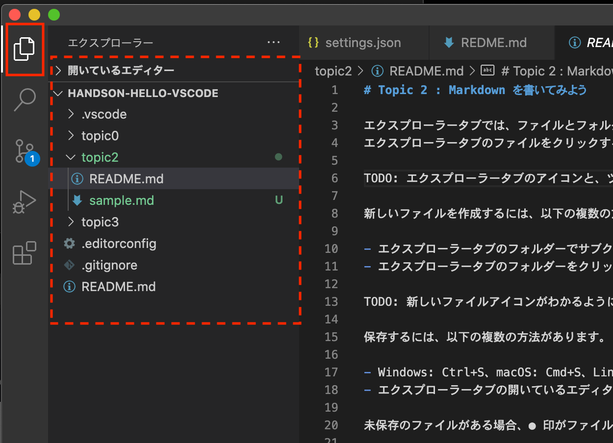
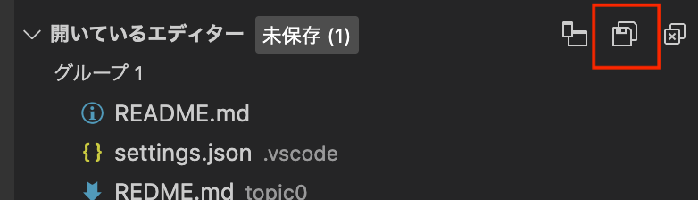
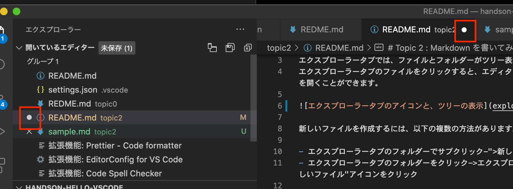
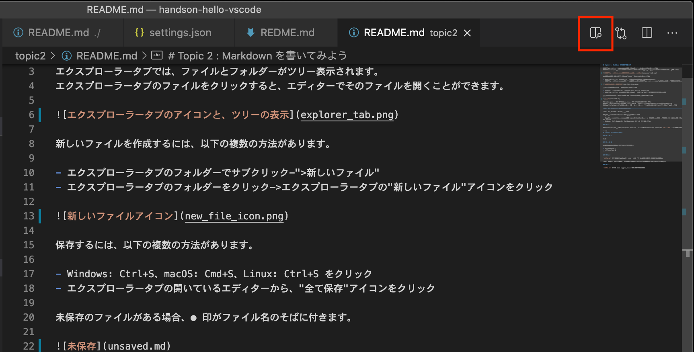
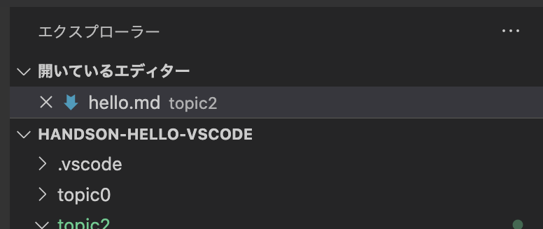

# Topic 2 : Markdown を書いてみよう

エクスプローラービューでは、ファイルとフォルダーがツリー表示されます。
エクスプローラービューのファイルをクリックすると、エディターでそのファイルを開くことができます。



新しいファイルを作成するには、以下の複数の方法があります。

- エクスプローラービューのフォルダーでサブクリック->`新しいファイル`
- エクスプローラービューのフォルダーをクリック->エクスプローラービューの`新しいファイル`アイコンをクリック


保存するには、以下の複数の方法があります。

- macOS: Cmd+S、Windows・Linux: Ctrl+S をクリック
- エクスプローラービューの開いているエディターから、`全て保存`アイコンをクリック



未保存のファイルがある場合、● 印がファイル名のそばに付きます。



VS Code ではマークダウンをプレビューする機能がついています。
エディター右上のコードアクションから、`プレビューを横に表示`アイコンをクリックします。
このプレビューは変更内容がリアルタイムに反映されるため、表示しながら入力することもできます。



エディターを閉じるには、複数の方法があります。

- エディターの上部のタブのファイル名の右側に表示される ✕ 印をクリックします。カーソルを近づけると、✕ 印が表示されます。
- macOS: Cmd+W、Windows・Linux: Ctrl+W を押します。

## 課題 1

エクスプローラービューから、topic2 のフォルダーを開き、このフォルダーの中に `hello.md` を作成して下さい。

```md
# マークダウンのサンプル

## 見出し 1

本文

## 見出し 2

記号と項目の間には半角スペースを空ける

- リストの項目 1
- リストの項目 2
```

## 課題 2

`hello.md` を保存して、エディターのタブに "●" がつかない状態にして下さい。

**未保存の状態**


**保存済みの状態**



## 課題 3

`hello.md` を VS Code 内でプレビュー表示して下さい。
