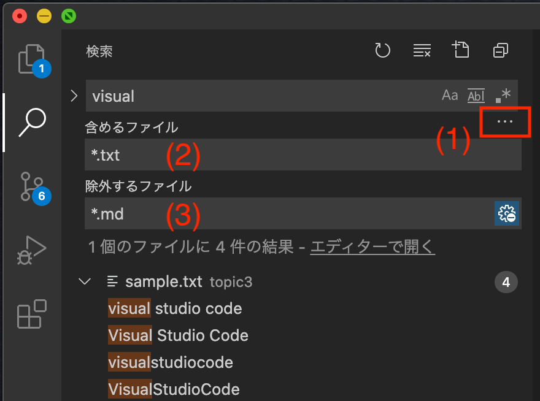
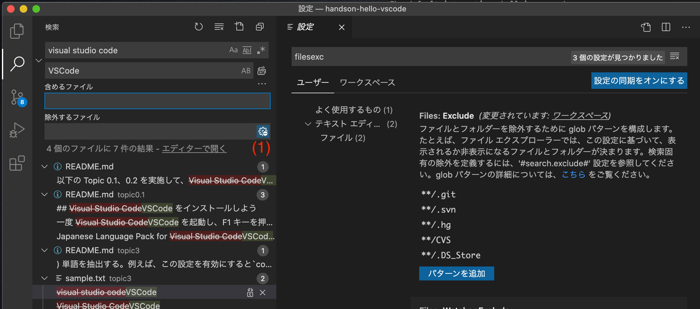

# ファイルを検索して、一括置換しよう

## 検索

検索ビューから、ワークスペース全体を全文検索することができます。


- アクティビティーバーから検索ビュー(1)をクリック
- サイドバーの入力欄(2)に検索テキストを入力
- サイドバー中の(3)に、ワークスペース中に見つかったテキストが、ファイルごとに表示
- サイドバーの行をクリックすると、その行がエディタ中(4)で開かれます。

入力欄の右側のボタンで、大文字小文字や単語検索など、検索する条件を設定できます

-  英語の大文字小文字を区別する
-  単語を抽出する。例えば、この設定を有効にすると`code`で検索すると、`visual studio code !`の`code`は抽出されるが、`learn vscode !`の`vscode`は抽出されない。
-  正規表現で検索する

## 置換

この検索ビューでは、確認しながら置換をおこなったり、一括置換を行うことができます。


- (1)をクリックし、2 行目に置換後の文字列を入力
- サイドバー中(2)に検索された行が表示される
- (2)中の行をクリックすると、エディター中に差分が表示される
- 各行の右側の(3)をクリックすると、その 1 行だけ、置換を実行
- (4)をクリックすると、全てを一括して置換
- 一括置換の前に、置換したくない箇所が含まれている場合、(5)をクリックするとその行が消えて、一括置換の対象から除外されます

## 検索に含むファイルと含まないファイルの設定

検索対象とするファイルを GLOB 形式（`some/*_test.png`や、`./**/*.png`など）を用いて、絞り込む、または除外することができます。



- (1)をクリック
- 含めるファイル(2)、除外するファイル(3)を、GLOB 形式で入力

### 特定のフォルダー内を検索

特定のフォルダーを検索対象とする場合には、エクスプローラービューのフォルダーを右クリックして、"フォルダー内の検索..."をクリック


## 前後を確認しながら検索（検索エディター）

検索エディターを使うと、検索した前後の行を確認しながら、一覧表示させることができます。


- 新規検索エディターボタン(1)をクリック
- (2)に検索文字列を入力
- (3)で表示する前後の行数を設定

## クイック検索

エディター画面内で、macOS: Cmd+F、Windows/Linux: Ctrl+F を押すとファイル内を検索したり、置換できるクイック検索が利用できます。


## クイック検索で、選択した範囲だけを置換する

行番号(1)をドラッグし、行を選択した状態で、(2)を押すと、クイック検索の対象とする行を選択した行のみとすることができます。


この機能により、特定の行のみを置換することも可能です。


## 課題のヒント 課題を実行した後に、変更したファイルをもとに戻したい場合

課題を実行して、ファイルを書き換えてしまった場合、もとに戻すには、ソースコントロールビューから、該当ファイルの右側に表示される"変更を破棄"アイコンをクリック


## 課題 1

この課題では検索ビューを使い、エディターで直接変更しないで下さい。

topic3 フォルダーに含まれるマークダウン中の grape を grapefruit に置換して下さい。

## 課題 2

この課題では検索ビューを使い、エディターで直接変更しないで下さい。

topic3 フォルダーに含まれるマークダウンには、 apple と pineapple が含まれています。
apple だけを orange に一括置換して下さい。

## 課題 3

この課題では検索ビューを使い、エディターで直接変更しないで下さい。

topic3 フォルダーは、中に topic3-1、topic3-2 のフォルダーがあります。
topic3-1 のフォルダーのファイルの lemon を citrus に一括置換して下さい。

```
`-topic3
  |-topic3-1
  `-topic3-2
```

## 課題 4

task4.md をエディターで開き、クイック検索を使って、apple を orange に一括置換してください。

### 応用問題

task4.md の 5 行目と 6 行目を選択し、この中に含まれている orange だけを apple に置換してください。

## Advanced Tips 常に検索から除外するファイルを設定する

設定の Files Exclude に常に除外するパターンを登録しておくくと、除外するファイルに逐一追加しなくても検索から除外させることができます。
ただし、図中の(1)が有効になっている場合のみ有効です（初期状態で有効になっています）。


