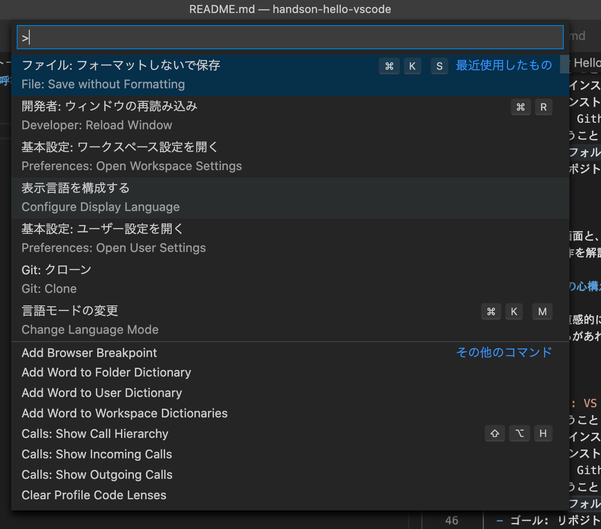
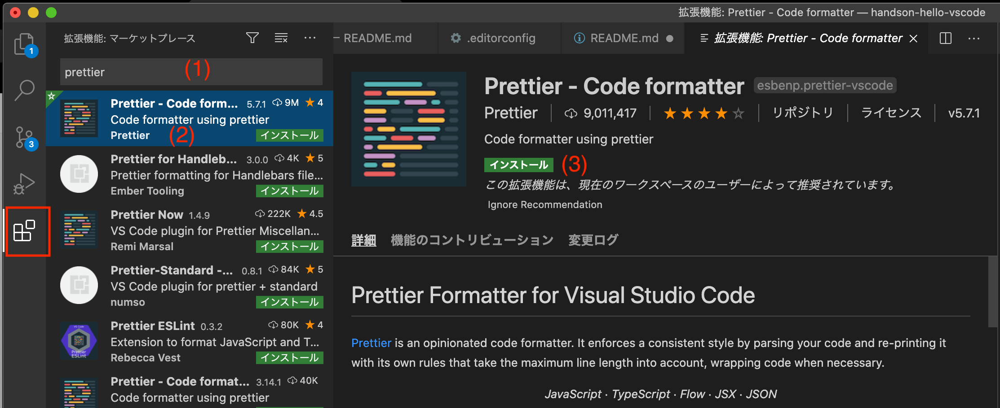
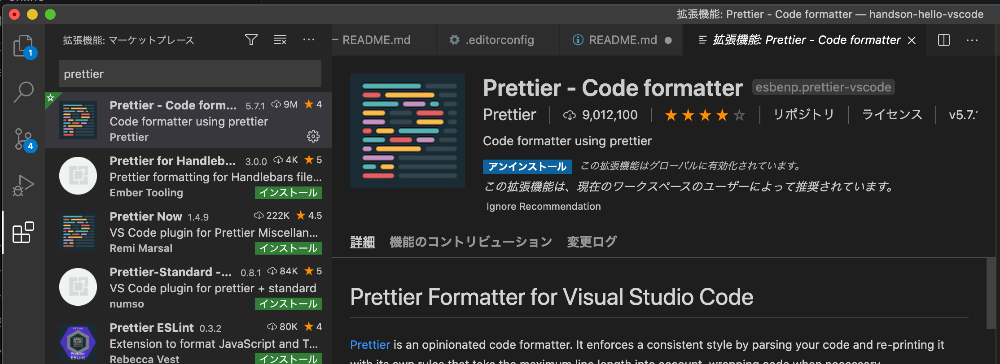
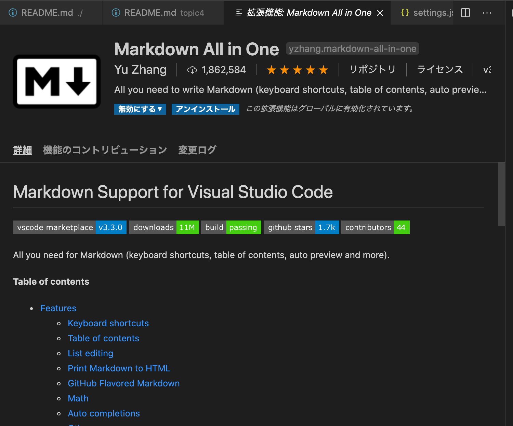
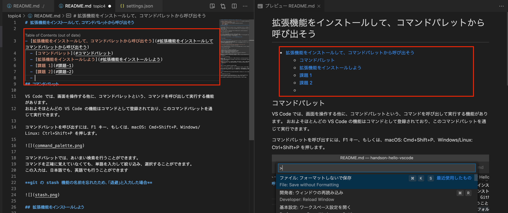
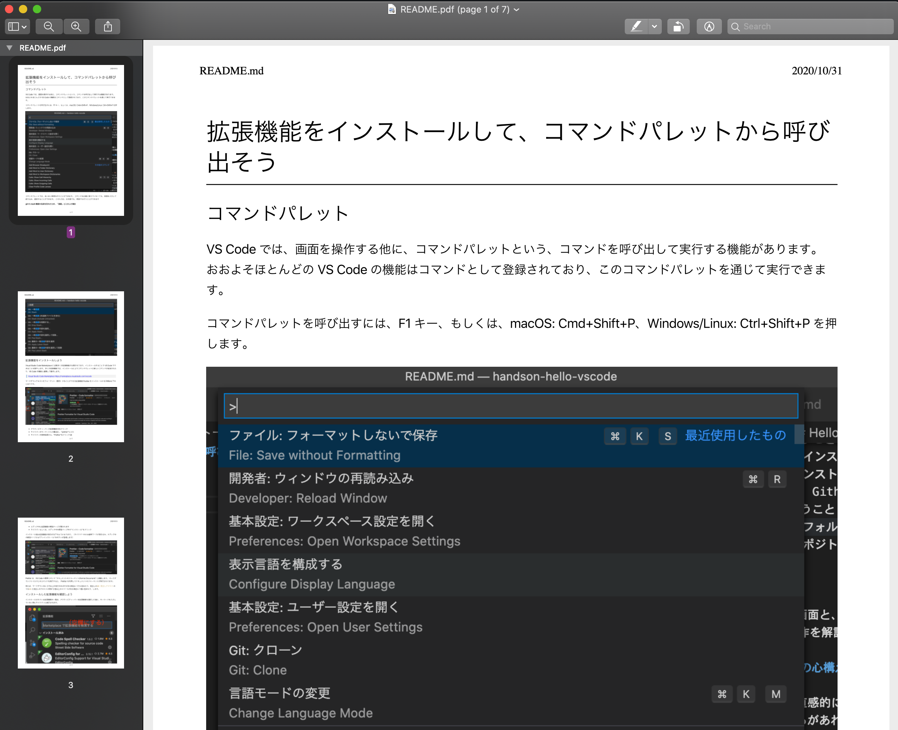

# 拡張機能をインストールして、コマンドパレットから呼び出そう

## コマンドパレットを使ってみよう

VS Code では、画面を操作する他に、コマンドパレットという、コマンドを呼び出して実行する機能があります。
おおよそほとんどの VS Code の機能はコマンドとして登録されており、このコマンドパレットを通じて実行できます。

コマンドパレットを呼び出すには、F1 キー、もしくは、macOS: Cmd+Shift+P、Windows/Linux: Ctrl+Shift+P を押します。

コマンドパレットでは、あいまい検索を行うことができます。
コマンドを正確に覚えていなくても、単語を入力して絞り込み、選択することができます。
この入力は、日本語でも、英語でも行うことができます

**（例）git の stash 機能の名前を忘れたため、「退避」と入力した場合**

## 拡張機能をインストールしよう

Visual Studio Code Marketplace には数多くの拡張機能が公開されており、インストールすることで VS Code でできることを増やします。
多くの拡張機能では、インストールによりコマンドパレットに新しいコマンドが追加されたり、VS Code の機能と連携して動作します。

> [Visual Studio Code Marketplace https://marketplace.visualstudio.com/vscode](https://marketplace.visualstudio.com/vscode)

マークダウンテキストをフォーマット（整形）することができる拡張機能 Prettier をインストールする手順は以下のとおりです。

- アクティビティーバーの拡張機能(1)をクリック
- サイドバーのキーワード入力欄(2)に、"prettier"と入力
- サイドバーの検索結果から、"Prettier"をクリック(3)
- エディタ中に拡張機能の解説ページが開かれます
- サイドバーもしくは、エディタ中の解説ページ中の"インストール"(4)をクリック

インストール後は拡張機能の表示が以下のようになります。
（サイドバー中には歯車マークが表示され、エディタ中の解説ページには"アンインストール"のボタンが登場します）

Prettier は、VS Code の標準コマンド "ドキュメントのフォーマット(Format Document)" と連動します。
マークダウンファイルでこのコマンドを実行すると、 Prettier を利用してドキュメントのフォーマットが実行されてます。

例えば、マークダウン中に 2 行以上の改行のみの行がある場合に 1 行に詰めたり、見出しの`## 見出しテキスト`のうち`##` と見出しのテキストの間が 2 個以上のスペースがある場合に 1 個に詰めたりします。

## インストールした拡張機能を確認しよう

インストールされている拡張機能の一覧は、アクティビティーバーを拡張機能を選択した後に、キーワードを入力していない時にサイドバーに表示されます。

拡張機能を削除するには、削除したい拡張機能の右側の歯車アイコンをクリックし、"アンインストール"をクリックします。

## 課題 1

拡張機能 Prettier をインストールしてください。

Prettier を使って、Topic 2 で作成したマークダウンをフォーマットを行ってください。

フォーマットが行われたことを確認するため、一度意図的に改行の数を増やしていただき、コマンドを実行してフォーマットによって改行が詰められることを確認いただけると良いと思います。

## 課題 2

マークダウンを編集に役立つ機能を多く持っている拡張機能 "Markdown All in One" があります。

この拡張機能をインストールすると、"Markdown All in One: 目次(TOC)の作成（Create Table of Contents）" というコマンドがコマンドパレットに追加されます。

topic4/README.md を開いて、このコマンドを実行して、目次を追加してください。

## 課題 3

マークダウンを PDF に変換する拡張機能 "Markdown PDF" があります。

この拡張機能をインストールし、topic4/README.md を PDF に変換してください。

ヒント: 拡張機能をインストールして追加されるコマンドの多くは、コマンド中に拡張機能の名前を含んでいます。コマンドパレットで拡張機能の名前を入力すると、その拡張機能で追加されたコマンドを見つけることができます。

この機能を使って PDF を作成すると、マークダウンと同じ名前の PDF ファイルが作られます。
エクスプローラービュー中に PDF ファイルがあることが確認できると思います。
VS Code の標準機能では PDF を表示することはできません。
エクスプローラービューでは、ファイルを右クリックして、macOS: "Finder で開く"、Windows: "Explorer で開く"、Linux: "このアイテムをフォルダーで開く" を選択すると、そのファイルのフォルダーを表示することができます。

ここから Adobe Reader など他のソフトウェアを使って PDF を表示してみてください。

