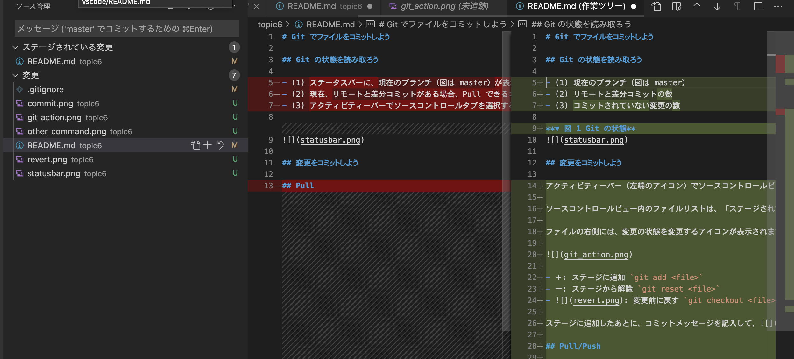
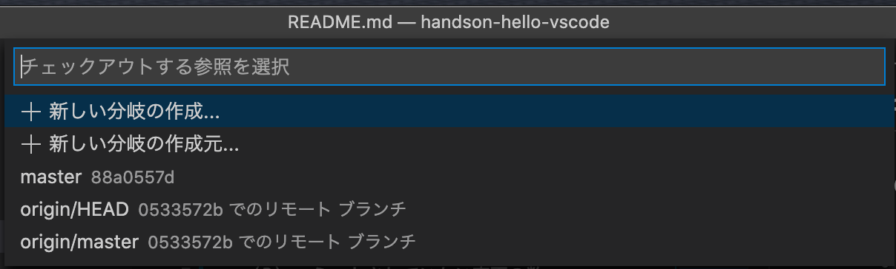
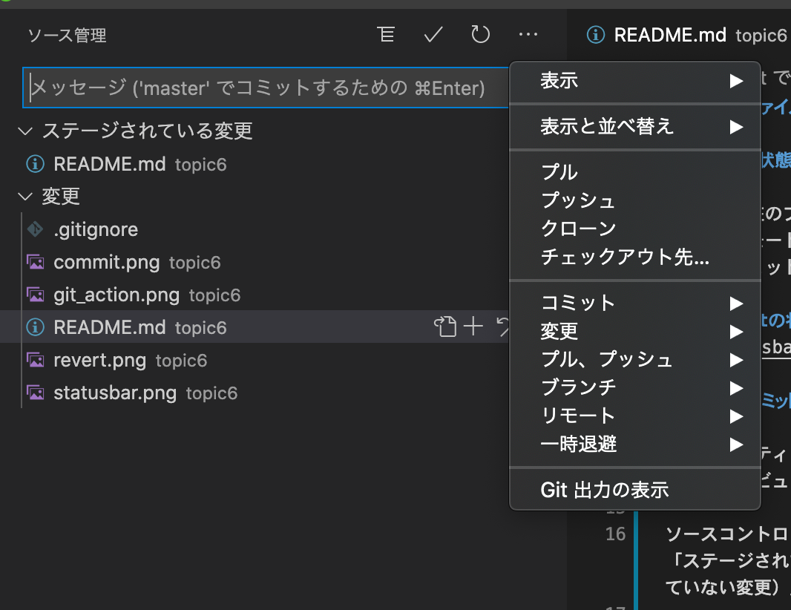

# Git でファイルをコミットしよう

本 Topic は Git について理解されている方向けの説明になっております。

Git を使われていないようであれば、この Topic 6 はスキップして、Topic 7 に進んでください。

## Git の状態を読み取ろう

- (1) 現在のブランチ（図は master）
- (2) リモートと差分コミットの数
- (3) コミットされていない変更の数

**▼ 図 1 Git の状態**


## 変更を確認して、コミットしよう

アクティビティーバー（左端のアイコン）で開くソースコントロールビューでは、変更されたファイルの一覧が表示されます。
ファイルを選択すると、変更の差分が表示されます。



ソースコントロールビュー内のファイルリストは、「ステージされている変更」と「変更（ステージされていない変更）」2 つの領域に分かれています。

ファイルの右側には、変更の状態を変更するアイコンが表示されます。


- ＋: ステージに追加 `git add <file>`
- ー: ステージから解除 `git reset <file>`
- : 変更前に戻す `git checkout <file>`

ステージに追加したあとに、コミットメッセージを記入して、を押すと、変更がコミットされます。

## Pull/Push

Push と Pull を同時に行うには、ステータスバーのリモートとの差分コミットの数（図 1 の(2)）をクリックします。

Push、Pull をそれぞれ行う場合には、コマンドパレットやオプションボタン（その他の Git の操作参照）から操作できます。

## ブランチを切り替える

ステータスバーのブランチ名（図 1 の(1)）をクリックします。



## その他の Git の操作

コマンドパレットには多くの Git コマンドがあります。
ソースコントロールビューのオプションボタンでも、Git の操作を行えます。



## 課題 1 GitHub からソースコードをクローンしよう

GitHub アカウントを持っている場合、ハンズオンリポジトリをフォーク（GitHub 上で右上の Fork をクリック）して、自分のアカウントのリポジトリを VS Code で開いてください。

> ハンズオンのリポジトリ: https://github.com/vscodejp/handson-hello-vscode

ヒント アカウント `<UserName>` の場合、GitHub からクローンするには、以下のコマンドを実行します。その後、VS Code で開きます。

```
git clone https://github.com/hoge/handson-hello-vscode
cd handson-hello-vscode
code .
```

## 課題 2 新しいブランチを作ろう

新しいブランチ "feature/topic6" を作成してください。

## 課題 3 ファイルを変更して差分を確認しよう

topic6/README.md のファイルに新しい行を追加したり、テキストを変更して、ソースコントロールビューから差分を表示させてください。


## 課題 4 ファイルの変更をコミットしよう

課題 3 の変更を、コメントを付けてコミットしてください。

ソースコントロールビューのリストの中から、変更したファイルが表示されなくなれば成功です。


## 課題 5 ファイルの変更を Push しよう

課題 1 でフォークされた方のみ、実施してください。

ファイルを Push して、github.com 上で行った変更を確認してみてください。ブランチを master から変更しているため、そのブランチを github.com 上で開く必要があります。

Push した後は、ステータスバーの差分コミットの矢印が消えて、以下のようになります。


