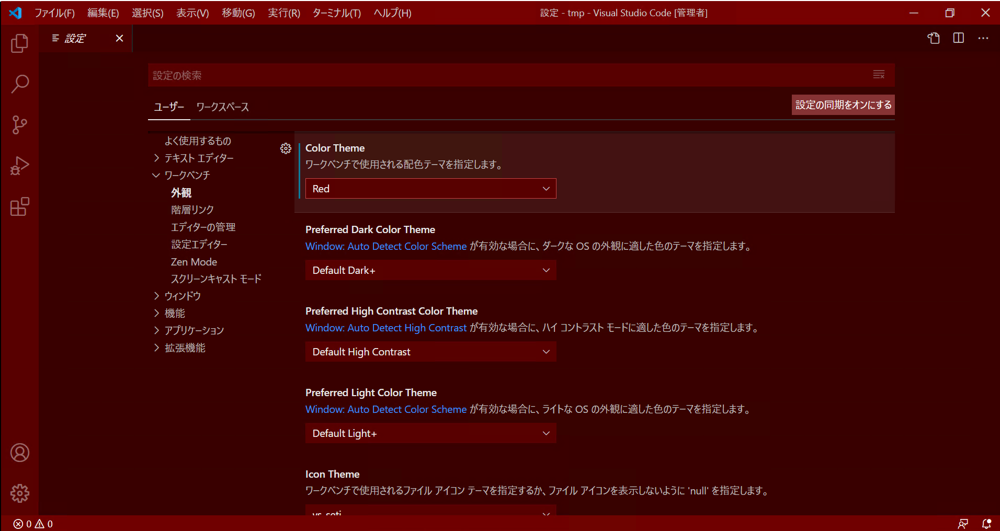

# Topic 7 : 自分好みにカスタマイズしよう

VS Code の設定画面は以下のいずれかの方法で開くことができます。

- 管理アイコン(サイドバー下部にある歯車マーク)から「設定」を選択
- ショートカット (`Ctrl + ,`)
- コマンドパレットから `基本設定: 設定（UI)を開く`

＜設定画面を開いたところ＞

設定項目は、

- 検索バーでの検索
- 設定項目のグループ見出し
  から探すことができます。

### 設定の適用範囲

VS Code には 2 種類の設定があります。

- ユーザー設定  
  VS Code を使用しているユーザーに対して適用される設定
- ワークスペース設定  
  ワークスペースに対してのみ適用される設定。

ユーザー設定とワークスペース設定で別の設定がされている場合、  
ワークスペース設定が優先されます。

## 設定を変更する

練習として、VS Code の配色テーマの設定をしてみましょう。

- 設定項目名 : Color Theme
  - 項目の場所 : ワークベンチ → 外観 → Color Theme

デフォルト値は「Default Dark+」になっています。  
「Defaul Dark+」をクリックすると他の設定値が表示されます。  
お好みのテーマを選択してみましょう。  
UI の色が変わりましたね。

＜配色テーマ Red を選択したときの画面＞

## 課題 1

サイドバー(Side Bar)の位置(Location)をウィンドウの右側に変更してください

＜設定後＞

## 課題 2

保存したときに自動フォーマットがかかるように設定してください。

**TODO 設定が成功した場合の挙動**

## ショートカットの設定

**TODO**

## 課題 3

お好みのキーにフォーマットのコマンドを設定してください。

**TODO**
