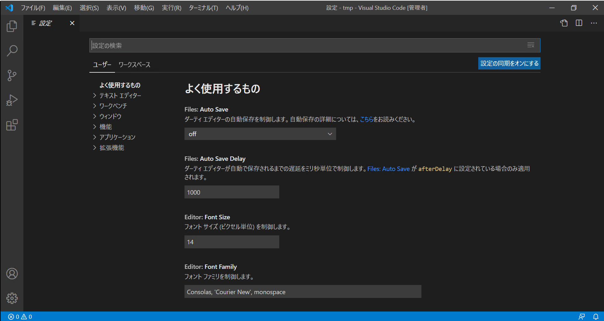
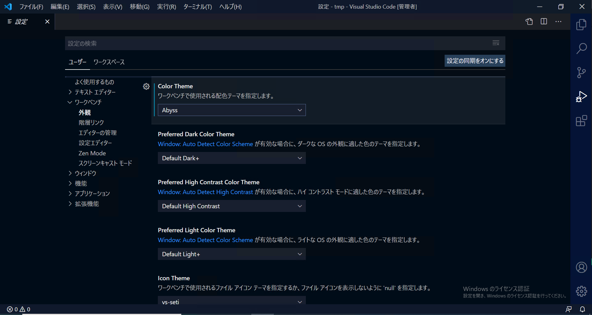
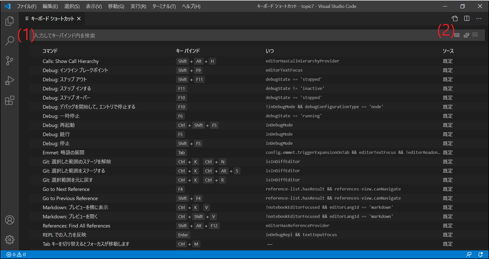
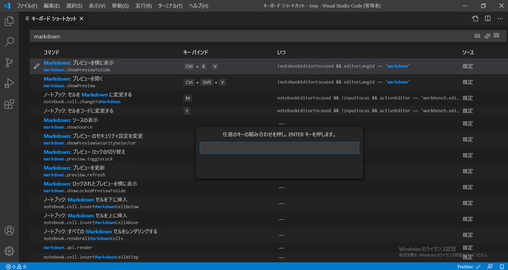
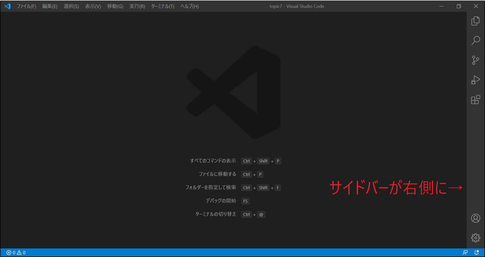
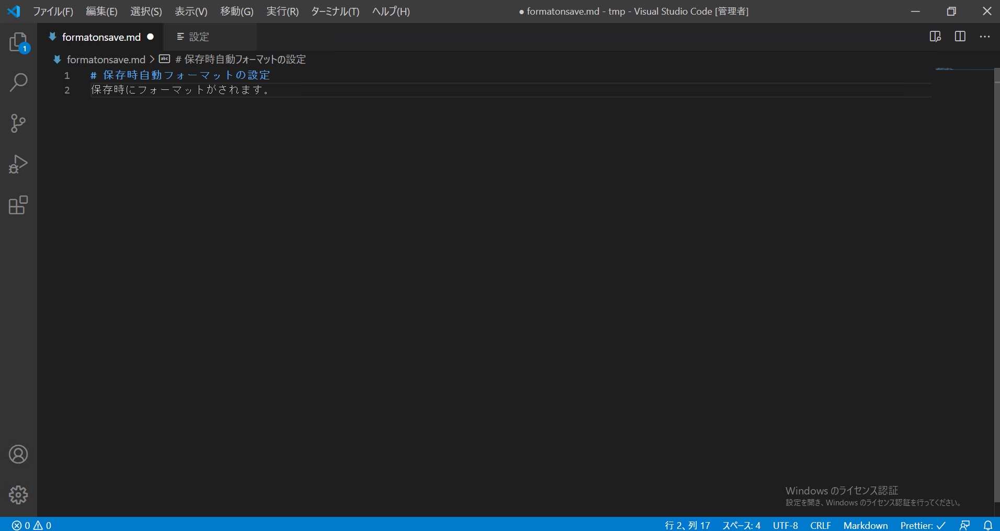
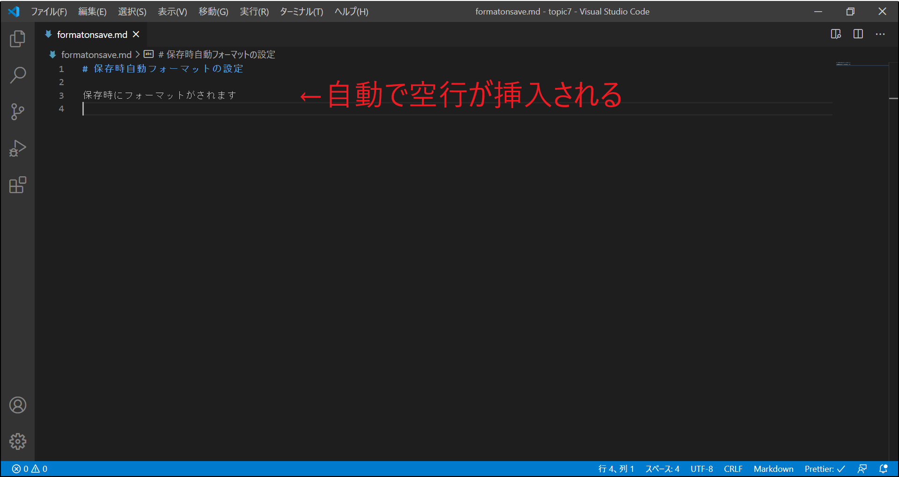

# Topic 7 : 自分好みにカスタマイズしよう

VS Code の設定画面は以下のいずれかの方法で開くことができます。

- 管理アイコン(サイドバー下部にある歯車マーク)から「設定」を選択
- ショートカット (`Ctrl + ,`)
- コマンドパレットから `基本設定: 設定（UI)を開く`

＜設定画面を開いたところ＞

設定項目は、

- 検索バーでの検索
- 設定項目のグループ見出し
  から探すことができます。

VS Code には 2 種類の設定があります。

- ユーザー設定  
  VS Code を使用しているユーザーに対して適用される設定
- ワークスペース設定  
  ワークスペースに対してのみ適用される設定。

ユーザー設定とワークスペース設定で別の設定がされている場合、  
ワークスペース設定が優先されます。

## 設定を変更する

練習として、VS Code の配色テーマの設定をしてみましょう。

- 設定項目名 : Color Theme
  - 項目の場所 : ワークベンチ → 外観 → Color Theme

デフォルト値は「Default Dark+」になっています。  
「Defaul Dark+」をクリックすると他の設定値が表示されます。  
お好みのテーマを選択してみましょう。  
UI の色が変わりましたね。

＜配色テーマ Abyss を選択したときの画面＞

## ショートカットの設定

VS Code に設定されているキーボードショートカットは以下のいずれかの方法で開くことができます。

- 管理アイコン(サイドバー下部にある歯車マーク)から「キーボードショートカット」を選択
- ショートカット (`Ctrl + K Ctrl + S`)
- コマンドパレットから `基本設定: キーボード ショートカットを開く`

ショートカットの検索方法は２種類あります。

- コマンド名で検索する  
  入力欄にキーワードを入力する
- キーバインドで検索する  
  `キーを記録`ボタンを有効にし、キーを入力する

また、好みのキーバインドの設定もできます。

1. 設定したいコマンドを選択する
1. `キーバインドの変更`アイコンをクリックする
1. キーバインドを入力する

設定したキーバインドは、右クリックから`キーバインドのリセット`を選択することで、デフォルト値に戻すことができます。

＜キーボードショートカット＞  
  
＜キーバインドの設定＞

## 課題 1

サイドバー(Side Bar)の位置(Location)をウィンドウの右側に変更してください

＜設定後＞  

## 課題 2

markdown ファイルを保存したときに自動フォーマットがかかるように設定してください。

- 準備  
  拡張機能「[Prettier](https://marketplace.visualstudio.com/items?itemName=esbenp.prettier-vscode)」をインストールする

- ヒント  
  「既定のフォーマッタの設定」と、「保存時の自動フォーマット有効化の設定」２種類の設定が必要になります。  
  この課題では「既定のフォーマッタ」には Prettier を選択してください。

＜設定後の挙動 : 保存前＞  
  
＜設定後の挙動 : 保存後＞  

## 課題 3

お好みのキーにフォーマットのコマンドを設定し、
設定したキーを使ってフォーマットをかけてみてください。

- 設定するコマンド  
  editor.action.formatDocument
