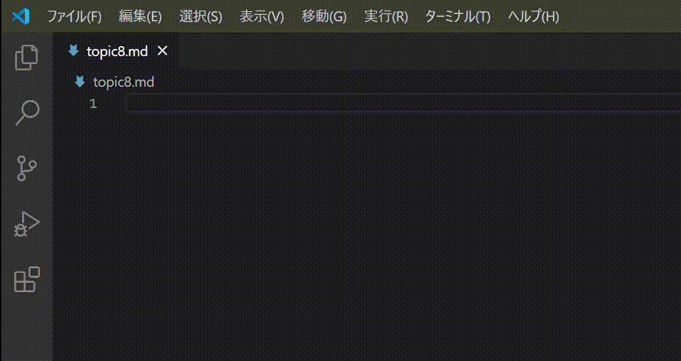
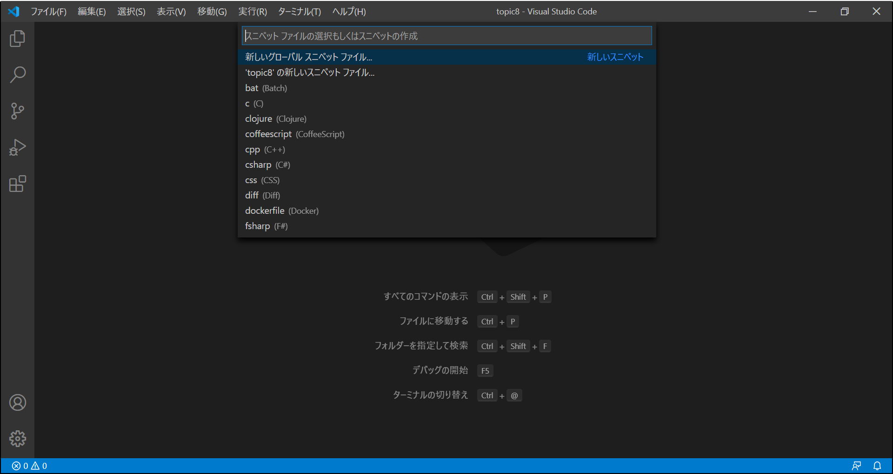
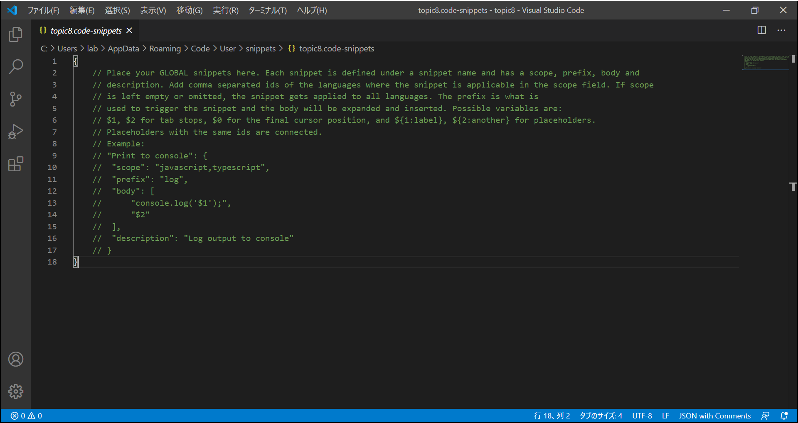
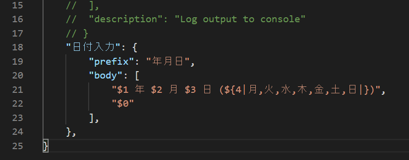
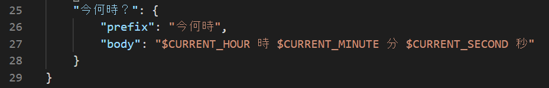

# Topic 8 : スニペットで定型文を簡単に入力しよう

`スニペット(snippet)`は、定型文を簡単に入力をするためのテンプレートです。  
スニペットを上手に利用すると入力作業の効率がアップします。

例えば、下記のような形式で日付を入力する場合、

```
2020 年 11 月 21 日 (土)
```

スニペットを利用すると以下のように入力を簡単にできます。



## スニペットの作り方

練習として、上述の日付入力スニペットを作ってみましょう。

初めに、スニペットの定義ファイルを作成します。  
管理アイコン(サイドバー下部にある歯車マーク)から「ユーザースニペット」を開きます。
するとコマンドパレットに各言語用の定義ファイルの選択肢が表示されるので、目的の定義ファイルを選びます。



今回は、`新しいのグローバルスニペットファイル`を選びましょう。  
新規の定義ファイルのため、ファイル名を入力を求められます。  
ファイル名を入力し、Enter キーを押してください。

すると`XXXX.code-snippets`というファイルが開きました。これがスニペットの定義ファイルです。



上述の日付入力スニペットは下の画像のように定義します。
画像と同じように入力してみましょう。



スニペット定義は以下の要素で構成されます。  
（このほかにも要素がありますが、最低限これら要素が書かれていれば OK）

1. スニペット名  
   上記例の"`日付入力`"にあたる部分。
1. prefix  
   スニペット一覧での表示名
1. body  
   挿入されるテンプレート本体。
   - プレースホルダー  
     body には`$`記号を使ってプレースホルダー(入力箇所)を設定することができます。  
     スニペット使用時に`$1`から順番に入力することができ、`$0`が終了位置となります。
   - 選択式  
     プレースホルダーの入力内容を選択式で表現することができます。
     選択肢を`|`記号で囲みカンマで区切ることで定義することができます。
     上記の日付入力スニペットでは、曜日を選択式で定義しています。

## スニペットの使い方

1. `Ctrl + Space`でスニペット一覧を表示する
1. スニペットを選び、`Enter`を押す。
1. プレースホルダーに入力する。  
   `Tab`を押すと次のプレースホルダーにカーソルが移動します。  
   また、選択式のプレースホルダーに到達すると選択肢が表示されるので、選んで`Enter`を押します。


## 課題

スニペットを作成してみましょう。

以下のようなフォーマットのスニペットを作成してください。  
ただし、次の 3 点を満たすこと。

- 月日を入力できるようにプレースホルダーを設定すること
- 進捗は 0, 50, 100%から選択できるようにすること
- "課題"の下の行を終了位置とすること

（細かな文言の差異や、空行のありなしはここでは気にしないで良いです）

```
業務報告（○月○日～○月○日）

進捗状況

・タスクA　進捗○○%
・タスクB　進捗○○%
・タスクC　進捗○○%

課題

```

## Advance TIPS

### スニペット定義に変数を使う

スニペット定義には変数を使うことができます。  
例えば、「今の時刻」を入力したいとき、変数を使うと、このように定義することができます。



ここでは以下の定義済みの変数を使っています。

- CURRENT_HOUR : 現在時刻(24 時制)
- CURRENT_MINUTE : 現在の分
- CURRENT_SECOND : 現在の秒

上記以外にも定義済みの変数があります。うまく使うとより効果的なスニペットが定義できるでしょう。  
もっと詳しく知りたい方はこちらの公式ドキュメントを参照してみましょう！  
https://code.visualstudio.com/docs/editor/userdefinedsnippets#_variables
